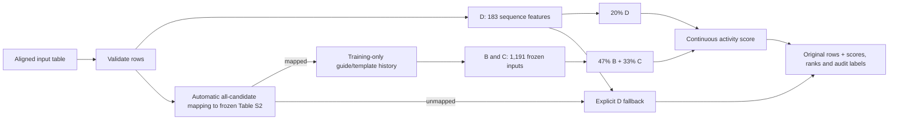

# Cas12a Activity Ranker

**Predict a continuous fluorescence-derived Cas12a activity value and rank already aligned crRNA–target pairs from a CSV, TSV or XLSX file.**

[中文说明](README_zh.md) · [Usage](docs/USAGE.md) · [Model card](models/MODEL_CARD.md) · [Results](docs/RESULTS.md) · [Reproducibility](docs/REPRODUCIBILITY.md)

> This is a research tool for the studied Cas12a molecular-detection assay. It does not predict genome-editing efficiency, patient diagnosis or clinical accuracy.

## Quick start

### 1. Install

Python 3.12 and Git LFS are required.

```bash
git clone https://github.com/ZebraL415/Cas12a-Activity-Ranker.git
cd Cas12a-Activity-Ranker
git lfs pull
python3.12 -m venv .venv
source .venv/bin/activate        # Windows: .venv\Scripts\activate
python -m pip install --upgrade pip
pip install -r requirements.txt
pip install --no-deps -e .
```

On macOS, XGBoost may also require `brew install libomp`.

### 2. Verify the installation

```bash
cas12a-ranker self-test
```

The bundled five-row example exercises exact, mismatch, gap, ambiguous-mapping and unmapped-fallback behavior.

### 3. Prepare one input table

Each row is one **already aligned** crRNA–target pair. Required columns are:

| Column | Rule |
|---|---|
| `record_id` | Nonempty and unique within the file |
| `crRNA_sequence` | Exactly 25 positions; A/C/G/T, with U normalized to T |
| `target_aligned_25` | Exactly 25 aligned positions; A/C/G/T or `-` |

```csv
record_id,crRNA_sequence,target_aligned_25,sample_note
candidate_01,TTTGTTGGGGCGTCCTTAGACGCCA,TTTGTTGGGGCGTCCTTAGACGCCA,exact pair
candidate_02,TTTGGGCTAGGTGTGATAGGAATGG,TTTGGGCTAGGAGTGATAGGAATGG,one mismatch
```

All extra columns and the original row order are preserved. Do not provide mapping columns: v2.0 calculates them automatically from `target_aligned_25`.

### 4. Predict

```bash
cas12a-ranker predict --input candidates.csv --output predictions.csv
```

The output keeps the input table and appends:

| Main output | Meaning |
|---|---|
| `cas12a_activity_score` | Final continuous prediction used for this row |
| `cas12a_activity_rank` | Descending global rank when all rows use a comparable route |
| `cas12a_rank_within_route` | Rank among rows that used the same route |
| `cas12a_prediction_d/b/c` | Auditable module predictions |
| `cas12a_prediction_full_dbc` | `0.20 D + 0.47 B + 0.33 C` when mapping succeeds |
| `cas12a_model_route` | Full v2 or explicit sequence-only fallback |
| `cas12a_mapping_*` | Automatic mapping result and retained candidates |
| `cas12a_guide_seen` / `cas12a_template_key_seen` | Whether frozen training history contains that key |
| `cas12a_warning_codes` | Machine-readable caveats for this row |

## What v2.0 does



- **D** combines sequence-only XGBoost, LightGBM and MLP predictions at 35%/59%/6%.
- **B** averages five mapping-aware XGBoost residual models.
- **C** combines guide-history and template-history anchors with a residual XGBoost model.
- The default full score is `0.20 × D + 0.47 × B + 0.33 × C`.

The guide and template history tables contain summaries from the 8,417-row training split only. Fixed-validation labels are not present in these deployment references.

## Mapping and fallback behavior

The program removes alignment gaps from the target, searches every frozen EasyDesign Table S2 template in both orientations, retains all exact candidates, and uses IUPAC-compatible matching only when no exact hit exists. It never silently selects the first candidate.

- **No mapping candidate:** output uses sequence-only D and reports `W_MAPPING_NOT_FOUND`.
- **Several candidates:** all candidates are retained; B/C use the same combined mapping key used during training.
- **Guide not seen in training history:** the frozen global training mean is used as the history prior and a warning is emitted.
- **Template key not seen in training history:** the same explicit prior fallback is used and reported.

If full v2 and fallback rows coexist, global `cas12a_activity_rank` is withheld by default because the scores came from different routes. `cas12a_rank_within_route` remains available. Use `--allow-mixed-ranking` only if that cross-route comparison is intentional. Use `--fallback-policy error` to stop instead of accepting unmapped rows.

## Performance and model decision

SCC/Spearman measures ranking; PCC/Pearson measures agreement with the continuous activity values. They are co-primary outcomes.

| Protocol | System | SCC ↑ | PCC ↑ | RMSE ↓ | MAE ↓ | R² ↑ |
|---|---|---:|---:|---:|---:|---:|
| 5-fold cross-fitted meta-OOF | Previous A+B+C | 0.8190 | 0.8119 | 0.3783 | **0.2889** | 0.6577 |
| 5-fold cross-fitted meta-OOF | **v2 D+B+C** | **0.8213** | **0.8133** | **0.3781** | 0.2907 | **0.6579** |
| Historical fixed validation | Previous A+B+C | 0.8424 | 0.8325 | 0.3536 | **0.2692** | 0.6917 |
| Historical fixed validation | **v2 D+B+C** | **0.8462** | **0.8355** | **0.3523** | 0.2707 | **0.6940** |

Replacing A with manifest-safe D improves cross-fitted SCC by `+0.00236`; its 2,000-resample target-cluster bootstrap interval is `[+0.00106, +0.00365]`. Cross-fitted PCC increases by `+0.00137`, but its interval slightly crosses zero. This supports the v2 update while keeping the claim metric-specific rather than calling every metric significantly better.

The team enumerated 5,151 coarse and 20,301 fine pooled D/B/C weight combinations, plus 101,505 fold-specific combinations. The pooled mathematical optimum was near 22.5%/47%/30.5%, but cross-fitted reweighting performed worse than the locked replacement. v2 therefore retains the pre-specified 20%/47%/33% weights instead of selecting the best-looking fixed-validation point.

The 2,217-row split is historical fixed validation, not an untouched external test. Most validation rows use guides seen in training, and this release is not evidence of universal performance on new assays or Cas12a orthologs.

## Verify the release

```bash
cas12a-ranker self-test
python -m unittest discover -s tests -v
python scripts/verify_repository.py
python scripts/reproduce_v2_metrics.py
```

Verification remaps all 10,634 train/validation rows, recreates the B/C feature matrix, compares every one of the 2,217 D/B/C/final predictions with the frozen oracle, recomputes SCC/PCC/error metrics, and audits all tested weights.

## Citation and license

The source task and data are from Huang B, Guo L, Yin H, et al., *Deep learning enhancing guide RNA design for CRISPR/Cas12a-based diagnostics*, **iMeta** (2024), [doi:10.1002/imt2.214](https://doi.org/10.1002/imt2.214). Cite that study and the repository commit used.

Project-owned software is licensed under [Apache License 2.0](LICENSE). Processed data and data-derived research artifacts are released under [CC BY 4.0](https://creativecommons.org/licenses/by/4.0/). See [THIRD_PARTY_NOTICES.md](THIRD_PARTY_NOTICES.md).
