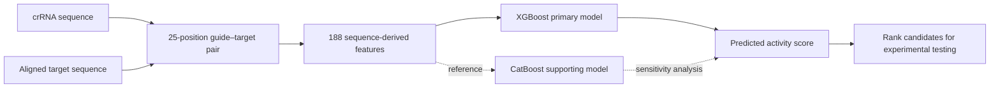

# Cas12a Activity Ranker

**A reproducible machine-learning toolkit for ranking Cas12a crRNA–target pairs by fluorescence-derived molecular-detection activity.**

[中文说明](README_zh.md) · [Usage guide](docs/USAGE.md) · [Data](docs/DATA.md) · [Model card](models/MODEL_CARD.md) · [Results](docs/RESULTS.md) · [License](LICENSE)

## Overview

Cas12a-based molecular detection begins with a design problem: one target sequence can produce many candidate crRNAs, but experimentally testing every candidate is slow. This project learns from measured fluorescence reactions and assigns each crRNA–target pair a continuous activity score, allowing promising candidates to be tested first.

The repository includes the processed research dataset, exact feature reconstruction, deployable native models, command-line inference, frozen predictions, uncertainty analysis and reproducibility tests.

> **Scope:** this is a research model for candidate ranking in a Cas12a fluorescence assay. It does not predict genome-editing efficiency, patient diagnosis, or clinical performance.

## From sequence pair to ranked candidate



The 188 candidate features describe five types of signal:

| Feature family | Count | Examples |
|---|---:|---|
| Pair alignment | 11 | Total differences, substitutions and target gaps |
| Position-specific events | 75 | Difference/substitution/gap indicators at each of 25 positions |
| Substitution type | 12 | A→C, A→G, … direct substitution counts |
| Sequence composition | 32 | GC content, entropy, base fractions and homopolymers |
| Sequence context | 58 | Local GC summaries and selected k-mer frequencies |

Five features are constant in training, so the deployed matrix contains 183 ordered inputs.

## Performance

All models below use the same 8,417 training records, 188-feature manifest and 2,217-record historical fixed validation split.

| Model | Spearman ↑ | RMSE ↓ | MAE ↓ | R² ↑ | Repository role |
|---|---:|---:|---:|---:|---|
| **XGBoost** | 0.7682 | **0.4231** | **0.3279** | **0.5584** | **Primary model** |
| CatBoost | 0.7582 | 0.4330 | 0.3396 | 0.5376 | Supporting model |
| Equal 50/50 ensemble | 0.7688 | 0.4249 | 0.3308 | 0.5547 | Sensitivity analysis |
| OOF-weighted 59/41 | **0.7693** | 0.4241 | 0.3298 | 0.5563 | Exploratory comparison |

The weighted ensemble is numerically highest in Spearman correlation, but its improvement over XGBoost is only `+0.0011`. A paired target-cluster bootstrap gives a 95% interval of `[-0.0020, 0.0043]`, so the improvement is not treated as established. XGBoost remains the primary model because it has the best absolute-error metrics and the simplest defensible deployment path.

See [Results](docs/RESULTS.md) for full metrics and interpretation.

## Installation

### Requirements

- Python 3.12
- macOS, Linux or Windows
- Approximately 1 GB free memory for standard inference

```bash
git clone https://github.com/ZebraL415/Cas12a-Activity-Ranker.git
cd Cas12a-Activity-Ranker

python3.12 -m venv .venv
source .venv/bin/activate        # Windows: .venv\Scripts\activate
python -m pip install --upgrade pip
pip install -r requirements.txt
pip install --no-deps -e .
```

On macOS, install the OpenMP runtime required by XGBoost:

```bash
brew install libomp
```

## Quick start

The input CSV needs one row per candidate pair.

| Column | Required | Description |
|---|---:|---|
| `crRNA_sequence` | Yes | Exactly 25 aligned positions. A/C/G/T; U is accepted and converted to T. |
| `target_aligned_25` | Yes for gaps | Exactly 25 aligned positions. A/C/G/T and `-` are accepted. |
| `target_sequence` | Alternative | May replace `target_aligned_25` only for a 25-nt no-gap target. |
| Any other columns | No | Preserved in the prediction output. |

Run the included example:

```bash
python scripts/predict_external.py \
  --input data/examples/external_sequence_pairs.csv \
  --output predictions.csv
```

The main output is `prediction_xgboost_primary`. Higher scores rank ahead of lower scores. The other prediction columns are reference/sensitivity outputs.

For gap-containing targets, supply an already aligned 25-position target. The software deliberately does not guess a biological alignment.

## Python usage

```python
from pathlib import Path
import pandas as pd

from cas12a_ml import Cas12aPredictor

repo = Path(".").resolve()
pairs = pd.DataFrame(
    {
        "candidate_id": ["candidate_01"],
        "crRNA_sequence": ["TTTGTTGGGGCGTCCTTAGACGCCA"],
        "target_aligned_25": ["TTTGTTGGGGCGTCCTTAGACGCCA"],
    }
)

predictions = Cas12aPredictor(repo).predict(pairs)
print(predictions[["candidate_id", "prediction_xgboost_primary"]])
```

When working directly from a clone without installing the package, either use `scripts/predict_external.py` or set `PYTHONPATH=src`.

## Reproduce and verify

```bash
# Verify data hashes, feature reconstruction, models and frozen predictions
python scripts/verify_repository.py

# Run unit tests
python -m unittest discover -s tests -v

# Verify the final training input contract
python scripts/train_final_four.py --verify-only

# Fit small versions of both learners as an environment smoke test
python scripts/train_final_four.py --smoke-test

# Recompute validation metrics and 2,000 target-cluster bootstrap resamples
python scripts/reproduce_metrics.py
```

A complete CPU retraining is available with:

```bash
python scripts/train_final_four.py --output reproduced_run
```

Full retraining performs ten OOF fits plus two final fits and can take substantially longer than the acceptance tests.

## Data

The processed V2-2 table contains 11,992 records:

- 8,417 final training records;
- 2,217 historical fixed-validation records;
- 1,358 external scale-unconfirmed records, preserved for lineage but excluded from final supervised claims.

The authoritative table SHA-256 is:

```text
39cda8368c216784507ac002df687b28a4f9cc6f81e2b0e84043e45eddb4c1c0
```

The fixed validation set was not used to choose the final ensemble weight, but it had been examined during earlier project development. It should therefore be described as historical fixed validation, not an untouched external test set.

See [Data contract and lineage](docs/DATA.md).

## Repository structure

```text
Cas12a-Activity-Ranker/
├── data/
│   ├── raw/                 Unmodified upstream repository data files
│   ├── processed/v2_2/      Final feature table, manifest and frozen folds
│   ├── examples/            Example inputs and expected predictions
│   └── metadata/            Public file checksums and data manifest
├── src/cas12a_ml/           Feature reconstruction and inference library
├── scripts/                 Prediction, training, verification and metrics
├── models/                  Native XGBoost and CatBoost artifacts
├── results/                 Frozen predictions and statistical results
├── tests/                   Regression and integrity tests
├── docs/                    Data, usage, results and reproducibility guides
└── .github/                 CI and contribution templates
```

## Limitations

- The activity score is specific to the studied fluorescence assay and normalization.
- Most validation records use guides observed in training; evidence for completely unseen guides is limited.
- Predicted values compress the extreme activity range.
- XGBoost and CatBoost predictions and residuals are highly correlated, limiting ensemble complementarity.
- New assay scales, Cas12a orthologs or sequence-preparation workflows require independent calibration.

## Contributing

Bug reports, documentation improvements and reproducibility fixes are welcome. Read [CONTRIBUTING.md](CONTRIBUTING.md) before opening an issue or pull request. Changes to the frozen benchmark should include a clear protocol, new output paths and updated tests; do not silently overwrite the reference data or results.

## Citation and data source

The experimental task and source data come from the EasyDesign Cas12a-based diagnostic design study:

- Huang B, Guo L, Yin H, et al. *Deep learning enhancing guide RNA design for CRISPR/Cas12a-based diagnostics*. **iMeta**. 2024;3(4):e214. [doi:10.1002/imt2.214](https://doi.org/10.1002/imt2.214)

When citing this software, cite the source study and the GitHub repository URL/commit used. A repository-level `CITATION.cff` should be added once the contributor names and preferred project citation have been confirmed.

## License

Project-owned software is released under the [Apache License 2.0](LICENSE). The four workbooks in `data/raw/easydesign_supplementary/` are unmodified, byte-verified files from the Apache-2.0-licensed EasyDesign repository. Processed data and data-derived research artifacts are released under [CC BY 4.0](https://creativecommons.org/licenses/by/4.0/) with source attribution and an explicit description of changes.

See [Third-party notices and data licensing](THIRD_PARTY_NOTICES.md) for the exact file scope, upstream commit, SHA-256 values and publisher-supporting-information attribution. A project-level `CITATION.cff` remains pending until the contributor order and preferred software citation are confirmed.
