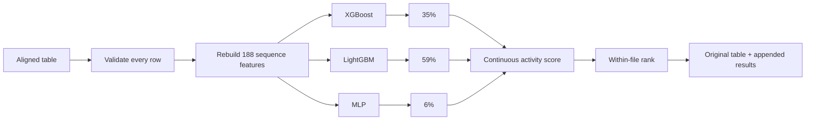

# Cas12a Activity Ranker

**Predict a continuous Cas12a fluorescence-derived activity value and rank aligned crRNA–target pairs from a CSV, TSV or XLSX file.**

[中文说明](README_zh.md) · [Usage](docs/USAGE.md) · [Model card](models/MODEL_CARD.md) · [Results](docs/RESULTS.md) · [Reproducibility](docs/REPRODUCIBILITY.md)

> **Scope:** this research tool predicts activity in the studied Cas12a molecular-detection assay. It does not predict genome-editing efficiency, patient diagnosis or clinical accuracy.

## Quick start

### 1. Install

Python 3.12 is supported.

```bash
git clone https://github.com/ZebraL415/Cas12a-Activity-Ranker.git
cd Cas12a-Activity-Ranker
git lfs pull

python3.12 -m venv .venv
source .venv/bin/activate        # Windows: .venv\Scripts\activate
python -m pip install --upgrade pip
pip install -r requirements.txt
pip install --no-deps -e .
```

On macOS, XGBoost may also require `brew install libomp`.

### 2. Check the installation

```bash
cas12a-ranker self-test
```

A successful installation prints `PASS Cas12a Activity Ranker self-test` after running four bundled sequence pairs through the complete pipeline.

### 3. Prepare a table

Each row is one already aligned crRNA–target pair. These column names are required:

| Column | Rule |
|---|---|
| `record_id` | Nonempty and unique within the file |
| `crRNA_sequence` | Exactly 25 aligned positions; A/C/G/T, with U accepted as T |
| `target_aligned_25` | Exactly 25 aligned positions; A/C/G/T or `-` |

Example:

```csv
record_id,crRNA_sequence,target_aligned_25,sample_note
candidate_01,TTTGTTGGGGCGTCCTTAGACGCCA,TTTGTTGGGGCGTCCTTAGACGCCA,exact pair
candidate_02,TTTGTTGGGGCGTCCTTAGACGCCA,TTTGTTGGGGCGTCCTTAGTCGCCA,one mismatch
```

Any additional columns are preserved unchanged.

### 4. Predict

```bash
cas12a-ranker predict --input candidates.csv --output predictions.csv
```

CSV, TSV and XLSX input/output are supported. The output has the same rows, order and original columns, with results appended:

| Main output | Meaning |
|---|---|
| `cas12a_activity_score` | v1.5 continuous activity prediction |
| `cas12a_activity_rank` | Descending rank within this input file; 1 is highest |
| `cas12a_prediction_status` | `success` or an explicit invalid-input status |
| `cas12a_model_route` | Model path used for this row |
| `cas12a_model_version` | Frozen model release |

The component predictions are also included for audit. Legacy v1.0 output columns remain available so existing workflows do not break.

If `--output` is omitted, the program creates `<input_name>_cas12a_predictions.<extension>`. Invalid files produce a row-level `<input_name>_input_errors.csv` report instead of silently changing data.

## What v1.5 runs



The v1.5 D model combines three learners trained on the same audited sequence representation:

```text
activity = 0.35 × XGBoost + 0.59 × LightGBM + 0.06 × MLP
```

The weights were selected from 5-fold target-grouped out-of-fold predictions on the 8,417-record training partition. Historical fixed-validation labels were not used in this weight search.

## Performance

SCC/Spearman measures ordering quality; PCC/Pearson measures agreement between predicted and observed activity values. Both are primary outcomes for this release.

| Model | SCC / Spearman ↑ | PCC / Pearson ↑ | RMSE ↓ | MAE ↓ | R² ↑ |
|---|---:|---:|---:|---:|---:|
| XGBoost component | 0.7652 | 0.7476 | 0.4247 | 0.3312 | 0.5550 |
| LightGBM component | 0.7690 | 0.7527 | 0.4207 | **0.3257** | 0.5635 |
| MLP component | 0.6347 | 0.6147 | 0.5175 | 0.4099 | 0.3395 |
| **v1.5 D ensemble** | **0.7709** | **0.7538** | **0.4205** | 0.3260 | **0.5639** |

These values use the same 2,217-record historical fixed-validation split. It was examined during earlier project development and is not described as an untouched external test set. Full OOF and fixed-validation outputs, all tested weight combinations and model metadata are stored in [`results/v1_5_d_ensemble`](results/v1_5_d_ensemble).

Compared with the v1.0 XGBoost release, D is numerically higher by `+0.0027` SCC and `+0.0040` PCC and lowers RMSE by `0.0027`. Paired target-cluster bootstrap intervals cross zero for all three changes, so v1.5 is released for its reproducible combined output and consistent numerical improvement—not as proof of universal superiority.

## Data and feature contract

The authoritative V2-2 table contains 11,992 records: 8,417 training, 2,217 historical fixed validation and 1,358 scale-unconfirmed external records excluded from supervised performance claims. Its SHA-256 is:

```text
39cda8368c216784507ac002df687b28a4f9cc6f81e2b0e84043e45eddb4c1c0
```

The builder reconstructs 188 sequence-derived features: pair alignment, position-specific events, substitution type, sequence composition and local sequence context. Five training constants are filtered, leaving 183 ordered deployed inputs.

## Verify the release

```bash
cas12a-ranker self-test
python -m unittest discover -s tests -v
python scripts/verify_repository.py
python scripts/reproduce_metrics.py
```

Verification checks model hashes, sequence-feature reconstruction, all 2,217 frozen predictions, SCC, PCC and error metrics. See [Reproducibility](docs/REPRODUCIBILITY.md).

## Repository map

```text
data/examples/                 Minimal user input and frozen expected output
data/processed/v2_2/           Authoritative table, feature manifest and folds
models/primary/                Frozen v1.5 XGBoost, LightGBM and MLP artifacts
results/v1_5_d_ensemble/       Weight grid, predictions, metrics and run manifest
src/cas12a_ml/                 Feature, model and table I/O implementation
scripts/                       Command wrappers and release verification
tests/                         Input, inference, feature and integrity tests
docs/                          Detailed use, evidence and reproducibility guides
```

## Limitations

- The activity scale is specific to the studied fluorescence assay and normalization.
- Most validation records use guides observed in training; evidence for completely new guides is limited.
- A within-file rank compares only the rows in that file; it is not a probability or clinical threshold.
- New Cas12a orthologs, assay scales or sequence-preparation workflows require independent validation.
- v1.5 requires already aligned 25-position pairs. Automatic biological alignment/mapping is outside this release.

## Citation and license

The source task and data are from Huang B, Guo L, Yin H, et al., *Deep learning enhancing guide RNA design for CRISPR/Cas12a-based diagnostics*, **iMeta** (2024), [doi:10.1002/imt2.214](https://doi.org/10.1002/imt2.214). Cite that study and the repository commit used.

Project-owned software is licensed under [Apache License 2.0](LICENSE). Processed data and data-derived research artifacts are released under [CC BY 4.0](https://creativecommons.org/licenses/by/4.0/). See [THIRD_PARTY_NOTICES.md](THIRD_PARTY_NOTICES.md) for exact scope and provenance.
