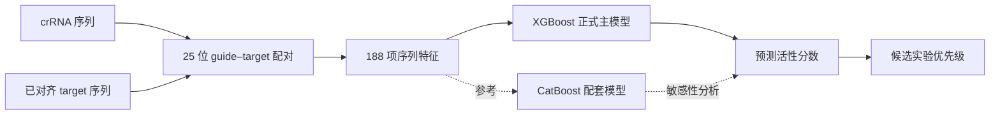

# Cas12a Activity Ranker

**根据 Cas12a crRNA–target 序列对预测荧光诊断反应活性，并对实验候选进行优先级排序的可复现机器学习工具。**

[English README](README.md) · [使用指南](docs/USAGE_zh.md) · [数据说明](docs/DATA_zh.md) · [模型卡](models/MODEL_CARD_zh.md) · [完整结果](docs/RESULTS_zh.md) · [许可证](LICENSE)

## 项目解决什么问题？

一个目标序列往往可以设计出许多候选 crRNA，但逐个做荧光实验耗时且成本高。本项目学习已有 Cas12a 荧光反应结果，为每一组 crRNA–target 配对预测连续活性分数，帮助实验人员优先验证更有希望的候选。

本仓库包含正式数据、精确特征重建、可直接调用的原生模型、命令行预测、冻结逐样本结果、统计不确定性分析和完整测试。

> 本项目预测的是 Cas12a 分子检测体系中的荧光反应活性，不是基因编辑效率、患者诊断结果或临床准确率。

## 工作流程



188 项候选特征包括：11 项配对总体特征、75 项逐位置事件、12 项替换类型、32 项序列组成和 58 项序列上下文。训练中有 5 项为常量，实际部署使用 183 项有序输入。

## 最终表现

| 模型 | Spearman ↑ | RMSE ↓ | MAE ↓ | R² ↑ | 定位 |
|---|---:|---:|---:|---:|---|
| **XGBoost** | 0.7682 | **0.4231** | **0.3279** | **0.5584** | **正式主模型** |
| CatBoost | 0.7582 | 0.4330 | 0.3396 | 0.5376 | 配套模型 |
| 50/50 等权组合 | 0.7688 | 0.4249 | 0.3308 | 0.5547 | 敏感性分析 |
| OOF 59/41 加权 | **0.7693** | 0.4241 | 0.3298 | 0.5563 | 探索性比较 |

加权组合的 Spearman 数值最高，但只比 XGBoost 高 `0.0011`，target-cluster bootstrap 95% 区间为 `[-0.0020, 0.0043]`，不足以证明稳定提升。因此 XGBoost 仍是正式主模型。

## 安装

```bash
git clone https://github.com/ZebraL415/Cas12a-Activity-Ranker.git
cd Cas12a-Activity-Ranker

python3.12 -m venv .venv
source .venv/bin/activate       # Windows: .venv\Scripts\activate
python -m pip install --upgrade pip
pip install -r requirements.txt
pip install --no-deps -e .
```

macOS 还需安装 XGBoost 使用的 OpenMP：

```bash
brew install libomp
```

## 快速预测

输入 CSV 每行代表一组候选，至少包含：

- `crRNA_sequence`：恰好 25 位，允许 A/C/G/T；U 会自动转成 T。
- `target_aligned_25`：恰好 25 个已对齐位置，允许 A/C/G/T 和 `-`。
- 无 gap 时可以用 `target_sequence` 替代 `target_aligned_25`。

运行仓库示例：

```bash
python scripts/predict_external.py \
  --input data/examples/external_sequence_pairs.csv \
  --output predictions.csv
```

正式结果列为 `prediction_xgboost_primary`，分数越大，排序越靠前。含 gap 的 target 必须事先完成对齐；程序不会自行猜测 alignment。

## 验证与复现

```bash
python scripts/verify_repository.py
python -m unittest discover -s tests -v
python scripts/train_final_four.py --verify-only
python scripts/train_final_four.py --smoke-test
python scripts/reproduce_metrics.py
```

完整 CPU 重训：

```bash
python scripts/train_final_four.py --output reproduced_run
```

## 数据概况

正式 V2-2 表包含 11,992 条记录：训练 8,417、历史固定验证 2,217、量纲未确认外部记录 1,358。外部记录只为血缘保留，不进入最终监督结果声明。

权威数据 SHA-256：

```text
39cda8368c216784507ac002df687b28a4f9cc6f81e2b0e84043e45eddb4c1c0
```

固定验证集没有参与最终组合权重选择，但在项目早期已经被查看，因此应称为“历史固定验证”，不能称为 untouched test。

## 目录

```text
data/raw/                 上游官方仓库原样数据文件
data/processed/v2_2/      最终特征表、manifest 和冻结 folds
data/examples/            外部输入示例及预期预测
src/cas12a_ml/            特征重建与模型推理
scripts/                  预测、训练、校验和指标复算
models/                   XGBoost/CatBoost 原生模型
results/                  冻结逐样本结果和统计分析
tests/                    完整性与推理回归测试
docs/                     使用、数据、模型和复现说明
```

## 局限

- 活性分数依赖当前荧光实验体系和归一化方式。
- 验证集中多数记录的 guide 在训练中见过，对完全新 guide 的证据有限。
- 模型会压缩极端活性范围。
- XGBoost 与 CatBoost 的预测和残差高度相关，组合互补性较弱。
- 新实验量纲、Cas12a ortholog 或序列处理流程需要独立校准。

## 贡献、引用与许可

提交 Issue 或 Pull Request 前请阅读 [CONTRIBUTING.md](CONTRIBUTING.md)。原始实验任务和数据来自 Huang 等发表于 *iMeta* 的 [EasyDesign 研究](https://doi.org/10.1002/imt2.214)；使用本仓库时应同时引用该研究和所使用的 GitHub commit。

本项目原创软件采用 [Apache License 2.0](LICENSE)。`data/raw/easydesign_supplementary/` 中四个工作簿是从 Apache-2.0 的 EasyDesign 官方仓库取得并逐字节核验的未修改文件；加工数据及数据衍生研究产物按 [CC BY 4.0](https://creativecommons.org/licenses/by/4.0/) 发布，并保留来源和改动说明。精确范围、上游 commit、SHA-256 与期刊补充材料归属见[第三方声明](THIRD_PARTY_NOTICES_zh.md)。项目作者顺序与推荐软件引用仍待确认，因此本轮不添加 `CITATION.cff`。
