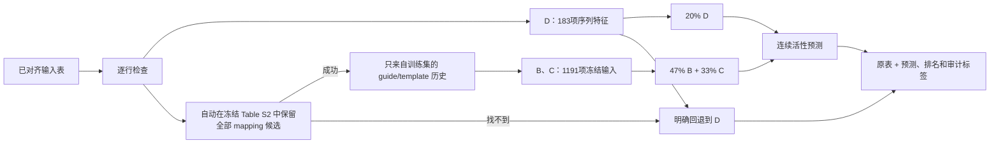

# Cas12a Activity Ranker

**读取 CSV、TSV 或 XLSX 中已经对齐的 crRNA–target 序列对，逐行预测 Cas12a 荧光来源的连续活性值，并给候选排序。**

[English](README.md) · [详细使用](docs/USAGE_zh.md) · [模型卡](models/MODEL_CARD_zh.md) · [结果解释](docs/RESULTS_zh.md) · [复现说明](docs/REPRODUCIBILITY_zh.md)

> 这是面向所研究 Cas12a 分子检测实验的科研工具，不预测基因编辑效率、患者诊断或临床准确率。

## 四步开始使用

### 1. 安装

需要 Python 3.12 和 Git LFS。

```bash
git clone https://github.com/ZebraL415/Cas12a-Activity-Ranker.git
cd Cas12a-Activity-Ranker
git lfs pull
python3.12 -m venv .venv
source .venv/bin/activate
python -m pip install --upgrade pip
pip install -r requirements.txt
pip install --no-deps -e .
```

### 2. 先跑自检

```bash
cas12a-ranker self-test
```

自检会真实运行 5 行示例，覆盖完全匹配、错配、gap、多候选 mapping 和无法 mapping 后回退。

### 3. 准备输入表

每行是一对**已经对齐**的序列，只要求三列：

| 列名 | 规则 |
|---|---|
| `record_id` | 文件内非空且唯一 |
| `crRNA_sequence` | 恰好 25 位，只含 A/C/G/T；U 会转为 T |
| `target_aligned_25` | 恰好 25 个对齐位置，可含 `-` gap |

```csv
record_id,crRNA_sequence,target_aligned_25,sample_note
candidate_01,TTTGTTGGGGCGTCCTTAGACGCCA,TTTGTTGGGGCGTCCTTAGACGCCA,exact pair
candidate_02,TTTGGGCTAGGTGTGATAGGAATGG,TTTGGGCTAGGAGTGATAGGAATGG,one mismatch
```

其他用户列和原始行顺序会原样保留。v2.0 不接收用户计算的 mapping 列，程序会根据 `target_aligned_25` 自动完成 mapping。

### 4. 预测

```bash
cas12a-ranker predict --input candidates.csv --output predictions.csv
```

结果表在原列后追加：

| 主要输出 | 含义 |
|---|---|
| `cas12a_activity_score` | 该行最终采用的连续活性预测 |
| `cas12a_activity_rank` | 同一可比路线下的全表降序名次 |
| `cas12a_rank_within_route` | 只在相同模型路线内部比较的名次 |
| `cas12a_prediction_d/b/c` | 三个模块的可审计预测 |
| `cas12a_prediction_full_dbc` | mapping 成功时的 `20% D + 47% B + 33% C` |
| `cas12a_model_route` | 完整 v2 或明确的 D 回退路线 |
| `cas12a_mapping_*` | 自动 mapping 状态及全部候选 |
| `cas12a_guide_seen` / `cas12a_template_key_seen` | 训练历史是否含这个键 |
| `cas12a_warning_codes` | 该行需要注意的机器可读提示 |

## v2.0 实际做了什么



- D 是 35% XGBoost、59% LightGBM 和 6% MLP 的序列模型。
- B 是 5 个 mapping-aware XGBoost 残差模型的平均。
- C 用 guide 历史和 template 历史组成锚点，再由 XGBoost 修正。
- 完整 v2 分数固定为 `0.20 × D + 0.47 × B + 0.33 × C`。

guide 和 template 历史参考表只用 8,417 行训练数据生成，不包含固定验证集标签。

## mapping 与回退怎样处理

程序先去除 target 中的对齐 gap，再在冻结的 EasyDesign Table S2 模板中同时搜索正向和反向互补序列；有精确结果就保留全部精确候选，没有精确结果时才检查 IUPAC 兼容候选。程序绝不会悄悄取“第一个结果”。

- 找不到候选：用 D 预测，并标记 `W_MAPPING_NOT_FOUND`。
- 找到多个候选：全部保留，B/C 使用训练时相同的候选组合键。
- 新 guide：历史部分回到训练集总体均值，并明确提示。
- 新 template-key：同样回到总体均值，并明确提示。

如果一个文件里同时出现完整 v2 和 D 回退行，默认不生成跨路线的 `cas12a_activity_rank`，避免把依据不同的分数强行排在一起；`cas12a_rank_within_route` 仍然存在。确实需要混合排名时使用 `--allow-mixed-ranking`，不接受回退时使用 `--fallback-policy error`。

## 表现与为何保留 20/47/33

SCC/Spearman 衡量排序，PCC/Pearson 衡量预测数值与真实活性的一致程度；两者都是一级指标。

| 验证方式 | 系统 | SCC ↑ | PCC ↑ | RMSE ↓ | MAE ↓ | R² ↑ |
|---|---|---:|---:|---:|---:|---:|
| 5 折 cross-fitted meta-OOF | 旧 A+B+C | 0.8190 | 0.8119 | 0.3783 | **0.2889** | 0.6577 |
| 5 折 cross-fitted meta-OOF | **v2 D+B+C** | **0.8213** | **0.8133** | **0.3781** | 0.2907 | **0.6579** |
| 历史固定验证 | 旧 A+B+C | 0.8424 | 0.8325 | 0.3536 | **0.2692** | 0.6917 |
| 历史固定验证 | **v2 D+B+C** | **0.8462** | **0.8355** | **0.3523** | 0.2707 | **0.6940** |

用 D 替换 A 后，cross-fitted SCC 提高 `0.00236`，2,000 次 target-cluster bootstrap 区间为 `[+0.00106, +0.00365]`。PCC 数值提高 `0.00137`，但区间轻微跨 0。因此可以说 v2 的排序证据更强、PCC 数值方向改善，不能说所有指标都已显著提高。

我们枚举了 5,151 个粗步长、20,301 个细步长总体权重，以及 101,505 个分折权重。总体数学最优约为 22.5%/47%/30.5%，但跨折重新选权重反而不如锁定的替换方案。因此 v2 保留事先存在的 20%/47%/33%，没有从固定验证集挑最好看的比例。

2,217 行属于历史固定验证，不是从未看过的外部测试；多数验证记录的 guide 在训练历史中出现过。不能据此宣称模型已普遍适用于新实验体系或新 Cas12a 类型。

## 验证本次发布

```bash
cas12a-ranker self-test
python -m unittest discover -s tests -v
python scripts/verify_repository.py
python scripts/reproduce_v2_metrics.py
```

完整检查会重新 mapping 10,634 行训练/验证记录，重建 B/C 特征，逐行比对 2,217 个 D、B、C 和最终预测，复算 SCC/PCC/误差指标，并核对全部权重枚举记录。

## 引用与许可

数据和原始任务来自 Huang B, Guo L, Yin H, et al., *Deep learning enhancing guide RNA design for CRISPR/Cas12a-based diagnostics*, **iMeta** (2024), [doi:10.1002/imt2.214](https://doi.org/10.1002/imt2.214)。使用时请同时引用该论文和实际采用的仓库 commit。

项目代码使用 [Apache License 2.0](LICENSE)；处理数据和数据衍生研究产物使用 [CC BY 4.0](https://creativecommons.org/licenses/by/4.0/)。具体边界见 [THIRD_PARTY_NOTICES_zh.md](THIRD_PARTY_NOTICES_zh.md)。
